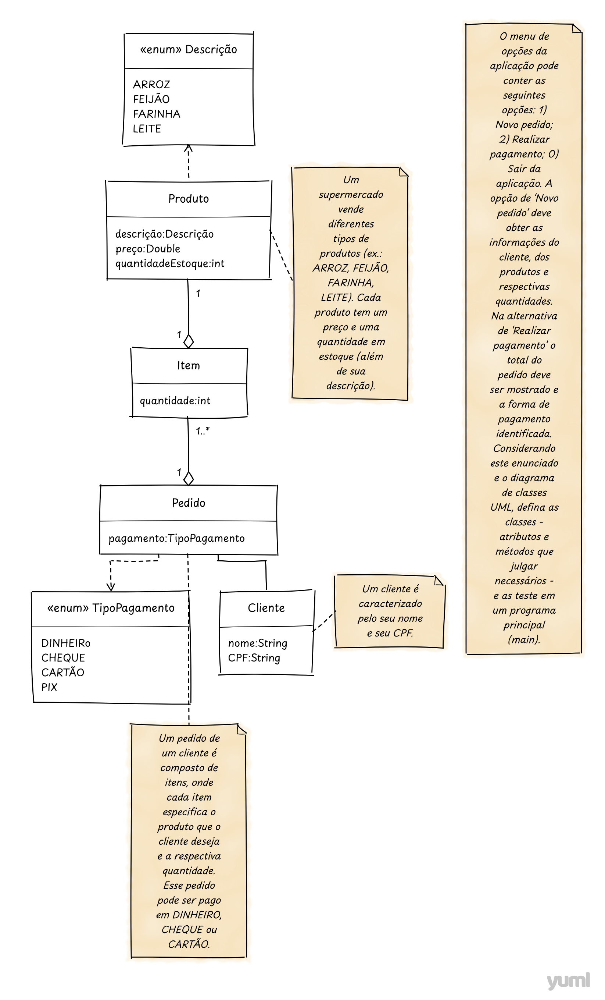

# Supermercado | Algoritmos e Classificação de Dados

---

## Sobre
Atividade de ACD, para implementar as classes conforme o diagrama do UML. Essa atividade foi 
solucionada com implementações das classes `Item`, `Cliente`, `Produto`, `Pedido` com as enumerações `TipoPagamento` 
e `Descricao`, além de exceções que apesar de não serem tão necessárias foram utilizadas para revisar o tratamentod e exceções.

Optei por uma abordagem onde os itens já são instanciados em uma Lista de `Item` e somente é pedido ao usuário
os dados do `Cliente`, os itens desejados para adicionar ao pedido e o tipo de Pagamento.

